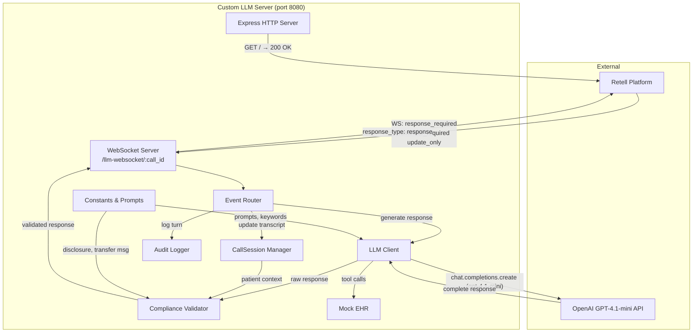
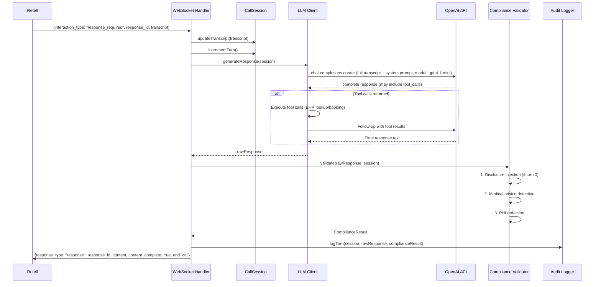

# Design Document: Custom LLM Server

## Overview

This design describes a Node.js/TypeScript WebSocket server implementing Retell AI's Custom LLM protocol for a HIPAA-compliant patient intake voice agent. The server acts as a bridge between Retell's real-time voice platform and OpenAI GPT-4.1, enforcing three compliance rules on every response before it reaches the caller.

**Key architectural decision:** Complete-response validation. Rather than streaming tokens from OpenAI directly to Retell (which would bypass compliance checks), the server waits for the full LLM response, runs all three compliance rules in sequence, and only then sends the validated response to Retell as a single complete message. This trades ~1.5s of total response latency for guaranteed compliance enforcement on every utterance. GPT-4.1-mini is chosen over GPT-4.1 full for its lower TTFT (~0.82s vs ~1.0s), bringing total end-to-end latency to approximately 1.5s — acceptable for phone conversations where backchannel fills silence.

**Protocol summary (from [Retell LLM WebSocket docs](https://docs.retellai.com/api-references/llm-websocket)):**
- Retell opens a WebSocket to `{server}/llm-websocket/{call_id}` when a call starts
- Incoming events are distinguished by `interaction_type`: `response_required`, `reminder_required`, `update_only`, `ping_pong`
- Outgoing events are distinguished by `response_type`: `response`, `config`, `ping_pong`, `tool_call_invocation`, `tool_call_result`
- Response events must echo back the `response_id` from the request, and include `content`, `content_complete`, and optionally `end_call` / `transfer_number`

## Architecture



### Request Flow (response_required)



## Components and Interfaces

### 1. Express HTTP Server (`server.ts`)

Entry point. Creates the Express app and HTTP server, mounts the health check route, attaches the WebSocket server, and starts listening.

```typescript
// GET / → { status: "healthy", timestamp: string }
```

### 2. WebSocket Server (`websocket-handler.ts`)

Upgrades HTTP connections on `/llm-websocket/:call_id` to WebSocket. Manages connection lifecycle:
- On connection: extract `call_id` from URL path, create `CallSession`
- On message: parse JSON, route by `interaction_type`
- On close: call `session.end()`, log call summary

```typescript
interface WebSocketHandler {
  handleConnection(ws: WebSocket, callId: string): void;
  handleMessage(ws: WebSocket, session: CallSession, data: RetellEvent): Promise<void>;
  handleClose(session: CallSession): void;
}
```

### 3. Event Router (`event-router.ts`)

Dispatches incoming events based on `interaction_type`:

```typescript
interface EventRouter {
  route(ws: WebSocket, session: CallSession, event: RetellEvent): Promise<void>;
  handleResponseRequired(ws: WebSocket, session: CallSession, event: ResponseRequiredEvent): Promise<void>;
  handleReminderRequired(ws: WebSocket, session: CallSession, event: ReminderRequiredEvent): Promise<void>;
  handleUpdateOnly(session: CallSession, event: UpdateOnlyEvent): void;
  handlePingPong(ws: WebSocket, event: PingPongEvent): void;
}
```

### 4. CallSession (`call-session.ts`)

Per-connection state container:

```typescript
interface CallSession {
  callId: string;
  turnCount: number;
  disclosureDelivered: boolean;
  transcript: TranscriptEntry[];
  patientContext: PatientContext | null;
  startTime: Date;
  endTime: Date | null;

  updateTranscript(entries: TranscriptEntry[]): void;
  incrementTurn(): void;
  setPatientContext(patient: PatientRecord): void;
  end(): void;
  getDuration(): number;
}
```

### 5. LLM Client (`llm-client.ts`)

Wraps the OpenAI SDK. Sends the system prompt + full transcript as messages to GPT-4.1-mini, handles tool calls (function calling), and returns the final text response. The model is configurable via the `OPENAI_MODEL` environment variable (default: `gpt-4.1-mini`).

```typescript
interface LlmClient {
  generateResponse(session: CallSession): Promise<LlmResult>;
}

interface LlmResult {
  content: string;
  toolCallsMade: ToolCallRecord[];
}
```

**Design decision:** The LLM client uses OpenAI's function calling (tools) to let GPT-4.1-mini invoke `lookup_patient`, `get_available_slots`, `book_appointment`, and `transfer_to_nurse`. When tool_calls are returned, the client executes them against Mock EHR, appends results to the conversation, and makes a follow-up API call to get the final text response. This loop continues until no more tool_calls are returned.

### 6. Compliance Validator (`compliance-validator.ts`)

Applies three rules in order. Short-circuits on medical advice detection.

```typescript
interface ComplianceValidator {
  validate(response: string, session: CallSession): ComplianceResult;
}

interface ComplianceResult {
  approved: boolean;
  originalResponse: string;
  finalResponse: string;
  action: "pass" | "modify" | "block_and_transfer";
  reason: string;
}
```

**Rule pipeline:**
1. **Disclosure injection** — If `turnCount === 0 && !disclosureDelivered`, prepend `HIPAA_DISCLOSURE` to the response. Set `disclosureDelivered = true`. Action: `"modify"`.
2. **Medical advice detection** — Case-insensitive search for any keyword in `MEDICAL_ADVICE_KEYWORDS`. If found, replace entire response with `TRANSFER_MESSAGE`. Action: `"block_and_transfer"`. **Short-circuits** — skip rule 3.
3. **PHI redaction** — If `patientContext` exists and response contains both full name AND date of birth together, remove the date of birth occurrence. Action: `"modify"`.

If no rule fires, action is `"pass"`.

### 7. Mock EHR (`mock-ehr.ts`)

In-memory data store with three functions exposed as tool implementations:

```typescript
interface MockEHR {
  lookupPatient(name: string, dob: string): PatientRecord | null;
  getAvailableSlots(): AppointmentSlot[];
  bookAppointment(patientId: string, slotTime: string): BookingResult;
}
```

### 8. Audit Logger (`audit-logger.ts`)

Writes NDJSON to stdout:

```typescript
interface AuditLogger {
  logTurn(entry: AuditEntry): void;
  logCallSummary(session: CallSession): void;
}
```

### 9. Constants (`constants.ts`)

Single module exporting: `SYSTEM_PROMPT`, `HIPAA_DISCLOSURE`, `TRANSFER_MESSAGE`, `MEDICAL_ADVICE_KEYWORDS`, `REMINDER_MESSAGE`.

## Data Models

### Retell Incoming Events

```typescript
interface TranscriptEntry {
  role: "agent" | "user";
  content: string;
}

interface BaseRetellEvent {
  interaction_type: string;
}

interface ResponseRequiredEvent extends BaseRetellEvent {
  interaction_type: "response_required";
  response_id: number;
  transcript: TranscriptEntry[];
}

interface ReminderRequiredEvent extends BaseRetellEvent {
  interaction_type: "reminder_required";
  response_id: number;
  transcript: TranscriptEntry[];
}

interface UpdateOnlyEvent extends BaseRetellEvent {
  interaction_type: "update_only";
  transcript: TranscriptEntry[];
}

interface PingPongEvent extends BaseRetellEvent {
  interaction_type: "ping_pong";
  timestamp: number;
}

type RetellEvent = ResponseRequiredEvent | ReminderRequiredEvent | UpdateOnlyEvent | PingPongEvent;
```

### Retell Outgoing Events

```typescript
interface ResponseEvent {
  response_type: "response";
  response_id: number;
  content: string;
  content_complete: boolean;
  end_call?: boolean;
}

interface PingPongResponse {
  response_type: "ping_pong";
  timestamp: number;
}

interface ToolCallInvocationEvent {
  response_type: "tool_call_invocation";
  tool_call_id: string;
  name: string;
  arguments: string;
}

interface ToolCallResultEvent {
  response_type: "tool_call_result";
  tool_call_id: string;
  content: string;
}
```

### Internal Models

```typescript
interface PatientRecord {
  id: string;
  name: string;
  dob: string; // ISO date: YYYY-MM-DD
  nextAppointment: string | null; // ISO datetime or null
}

interface AppointmentSlot {
  time: string; // ISO datetime
  provider: string;
}

interface BookingResult {
  success: boolean;
  message: string;
  appointment?: { patientId: string; time: string };
}

interface PatientContext {
  fullName: string;
  dob: string;
  patientId: string;
}

interface AuditEntry {
  timestamp: string; // ISO 8601
  callId: string;
  turnNumber: number;
  transcriptIn: string;
  rawLlmResponse: string;
  complianceAction: "pass" | "modify" | "block_and_transfer";
  complianceReason: string;
  finalResponseSpoken: string;
}

interface CallSummaryEntry {
  timestamp: string;
  callId: string;
  totalTurns: number;
  durationMs: number;
  event: "call_ended";
}

interface ToolCallRecord {
  name: string;
  arguments: Record<string, unknown>;
  result: unknown;
}
```


## Correctness Properties

*A property is a characteristic or behavior that should hold true across all valid executions of a system — essentially, a formal statement about what the system should do. Properties serve as the bridge between human-readable specifications and machine-verifiable correctness guarantees.*

### Property 1: Disclosure injection on first turn

*For any* LLM-generated response string and a CallSession with `turnCount === 0` and `disclosureDelivered === false`, running the Compliance Validator SHALL produce a ComplianceResult where: `finalResponse` starts with the `HIPAA_DISCLOSURE` text followed by the original response, `action` equals `"modify"`, and the session's `disclosureDelivered` flag is set to `true`.

**Validates: Requirements 7.1, 7.2, 7.3**

### Property 2: No disclosure after first turn

*For any* LLM-generated response string and a CallSession with `turnCount > 0` (regardless of `disclosureDelivered` value), running the Compliance Validator SHALL produce a `finalResponse` that does NOT begin with the `HIPAA_DISCLOSURE` text.

**Validates: Requirements 7.4**

### Property 3: Medical advice keyword detection and blocking

*For any* LLM-generated response string that contains at least one keyword from `MEDICAL_ADVICE_KEYWORDS` (in any case — upper, lower, mixed), running the Compliance Validator SHALL produce a ComplianceResult where: `finalResponse` equals `TRANSFER_MESSAGE`, `action` equals `"block_and_transfer"`, and `approved` is `false`.

**Validates: Requirements 8.1, 8.2, 8.3**

### Property 4: PHI redaction removes DOB but preserves first name

*For any* LLM-generated response that contains both the patient's full name and date of birth, when the CallSession has a `patientContext` set, running the Compliance Validator SHALL produce a `finalResponse` where: the date of birth string is removed, the patient's first name is still present, and `action` equals `"modify"`.

**Validates: Requirements 9.1, 9.2, 9.3, 9.4**

### Property 5: Medical advice blocking short-circuits subsequent rules

*For any* LLM-generated response that contains a medical advice keyword AND the session has patient context with name+DOB present in the response, the Compliance Validator SHALL return `action: "block_and_transfer"` with `finalResponse` equal to `TRANSFER_MESSAGE` — PHI redaction is never applied to the transfer message.

**Validates: Requirements 10.1, 10.2**

### Property 6: Disclosure rule chains with subsequent rules

*For any* LLM-generated response on a fresh session (`turnCount === 0`, `disclosureDelivered === false`) where the response also contains the patient's full name and date of birth (and patient context is set), the Compliance Validator SHALL produce a `finalResponse` that starts with the HIPAA_DISCLOSURE AND has the date of birth removed from the original response portion.

**Validates: Requirements 10.3**

### Property 7: Response event wire format

*For any* validated response produced by the server, the outgoing JSON message SHALL contain exactly these fields with correct types: `response_type` (string, always "response"), `response_id` (number), `content` (string), `content_complete` (boolean), and `end_call` (boolean).

**Validates: Requirements 11.1**

### Property 8: Audit entry completeness and NDJSON format

*For any* combination of callId, turnNumber, transcriptIn, rawLlmResponse, complianceAction, complianceReason, and finalResponseSpoken (including strings containing newlines, quotes, and special characters), the Audit Logger output SHALL be a single line of valid JSON containing all required fields with correct values.

**Validates: Requirements 12.2, 12.4**

### Property 9: Non-matching patient lookup returns null

*For any* name and date-of-birth combination that does not exactly match (case-insensitively for name, exactly for DOB) one of the 3 stored patient records, `lookupPatient` SHALL return `null`.

**Validates: Requirements 13.3**

### Property 10: Case-insensitive patient name matching

*For any* valid patient in the Mock EHR and *any* casing variation of that patient's name (e.g., "MARIA GARCIA", "maria garcia", "Maria garcia"), calling `lookupPatient` with that casing and the correct DOB SHALL return the matching patient record.

**Validates: Requirements 13.4**

### Property 11: Booking removes slot and updates patient

*For any* valid patient ID and any currently available appointment slot, calling `bookAppointment` SHALL: remove that slot from the available slots list (reducing count by 1), return a success result, and update the patient's `nextAppointment` field to the booked time.

**Validates: Requirements 14.3**

### Property 12: Invalid booking returns error

*For any* patient ID that doesn't exist in Mock EHR OR any slot time that is not currently available, calling `bookAppointment` SHALL return a result with `success: false` and a non-empty error message.

**Validates: Requirements 14.4**

### Property 13: Session state accumulation across turns

*For any* sequence of N transcript updates and M turn increments applied to a CallSession (where N, M ≥ 1), the session SHALL retain: all appended transcript entries in order, `turnCount` equal to M, and any patient context that was set — until `end()` is called.

**Validates: Requirements 4.3, 4.4, 17.3, 17.4**

## Error Handling

### OpenAI API Failures

When the OpenAI `chat.completions.create` call throws (network error, rate limit, timeout, invalid response):
1. Catch the error
2. Log an AuditEntry with `complianceAction: "error"`, `rawLlmResponse: ""`, and the error message as `complianceReason`
3. Send a graceful response to Retell: `"I apologize, but I'm experiencing a technical issue. Please hold while I connect you with a staff member."`
4. Set `end_call: true` to safely end the interaction

### WebSocket Errors

- **Malformed JSON** — If `JSON.parse` fails on an incoming message, log a warning with the raw data and ignore the message.
- **Connection drop** — On unexpected `close` or `error` events, call `session.end()` and log a call summary with a note about abnormal termination.

### Tool Call Failures

When a tool call (EHR lookup, booking) returns an error result:
- The error is returned to OpenAI as the tool result so the LLM can generate an appropriate user-facing message (e.g., "I couldn't find a patient with that information").
- No compliance blocking is triggered by tool failures.

### Invalid State Scenarios

- **Multiple response_required before reply** — Retell sends a new `response_id` when it needs a new response. Any in-flight response to a previous `response_id` is discarded by Retell. The server should abandon processing for the old request if a new one arrives (though with complete-response mode, this is unlikely to be an issue since responses are fast after the single API call).

## Testing Strategy

### Testing Framework

- **Unit/Example tests**: Vitest (fast, TypeScript-native, compatible with the project)
- **Property-based tests**: [fast-check](https://github.com/dubzzz/fast-check) integrated with Vitest
- **Mocking**: Vitest's built-in mocking for OpenAI SDK and WebSocket

### Property-Based Tests

Each correctness property maps to a single `fast-check` property test with minimum 100 iterations:

| Property | Module Under Test | Generator Strategy |
|----------|------------------|--------------------|
| 1: Disclosure injection | `compliance-validator` | `fc.string()` for response content |
| 2: No disclosure after turn 0 | `compliance-validator` | `fc.string()` + `fc.integer({min: 1})` for turnCount |
| 3: Medical advice blocking | `compliance-validator` | `fc.string()` + inject random keyword from list in random case |
| 4: PHI redaction | `compliance-validator` | Random name/DOB generators + response containing them |
| 5: Short-circuit on medical advice | `compliance-validator` | Response with keyword + PHI present |
| 6: Rule chaining | `compliance-validator` | Turn 0 + response with PHI |
| 7: Response format | `websocket-handler` | Random valid ComplianceResults |
| 8: Audit NDJSON | `audit-logger` | `fc.record()` with all AuditEntry fields |
| 9: Non-matching lookup | `mock-ehr` | `fc.string()` pairs avoiding the 3 known patients |
| 10: Case-insensitive lookup | `mock-ehr` | Known names with `fc.mixedCase()` transformation |
| 11: Booking success | `mock-ehr` | Pick from available slots + valid patient IDs |
| 12: Invalid booking | `mock-ehr` | Random invalid IDs or unavailable slot times |
| 13: State accumulation | `call-session` | `fc.array(fc.record(...))` for transcript sequences |

Each test is tagged with a comment:
```typescript
// Feature: custom-llm-server, Property 1: Disclosure injection on first turn
```

### Unit/Example Tests

Focus areas:
- Event routing dispatches to correct handler (5.1–5.4)
- Health check endpoint returns 200 with correct body (2.2–2.3)
- CallSession initialization (4.1–4.2)
- Response format with end_call=true on block (11.3)
- Response format with end_call=false on pass (11.4)
- Constants contain expected content (15.1–15.4)
- Patient lookup with known data (13.1–13.2)
- Available slots fixture data (14.1–14.2)

### Integration Tests

- Full request flow: WebSocket connect → send response_required → receive validated response
- OpenAI failure path: mock SDK to throw, verify graceful degradation
- Multi-turn conversation: verify state accumulates correctly across turns

### Test Configuration

```json
{
  "test": "vitest --run",
  "test:watch": "vitest"
}
```

Property tests run with `numRuns: 100` minimum. The `--run` flag ensures single execution (no watch mode).
