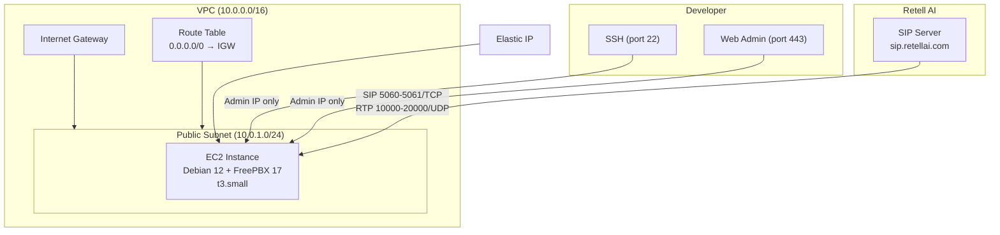
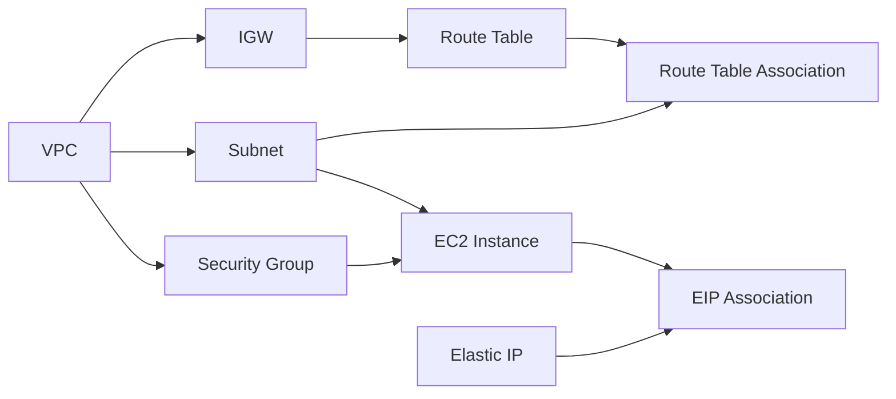

# Design Document: FreePBX Terraform Infrastructure

## Overview

This design describes a Terraform module that provisions a complete FreePBX 17 telephony infrastructure on AWS with a single `terraform apply` command. The module creates a VPC with public networking, launches a Debian 12 EC2 instance with FreePBX installed via the official Sangoma install script, assigns an Elastic IP for stable SIP connectivity, and configures security groups to allow SIP/RTP traffic from Retell AI IP ranges while restricting admin access.

The module is designed for blog readers following along with a HIPAA-compliant Voice AI demo — it handles the "annoying but not interesting" infrastructure setup so users can focus on FreePBX configuration and building the Custom LLM server.

### Key Design Decisions

1. **Debian 12 (Bookworm) as base OS** — FreePBX 17 officially dropped CentOS support and now only supports Debian 12. The official Sangoma install script (`sng_freepbx_debian_install.sh`) targets Debian 12 exclusively.

2. **Official Sangoma install script via user_data** — Rather than baking a custom AMI or manually installing packages, the EC2 user_data script downloads and runs the official FreePBX installer from [FreePBX/sng_freepbx_debian_install](https://github.com/FreePBX/sng_freepbx_debian_install). This takes ~30 minutes on first boot but ensures the latest FreePBX 17 build.

3. **Reference existing key pair** — The module accepts an existing AWS key pair name rather than generating one. This avoids storing private key material in Terraform state and respects the user's existing SSH workflow.

4. **Dynamic AMI lookup** — Uses `aws_ami` data source to find the latest official Debian 12 AMI (owner: `379101102735`) rather than hardcoding AMI IDs that vary by region and go stale.

5. **Single security group** — One security group with rules for both SIP/RTP (from Retell ranges) and admin access (from user's IP). Simpler than splitting into multiple groups for this demo use case.

## Architecture



### Resource Dependency Graph



## Components and Interfaces

### File Structure

```
terraform/
├── main.tf          # Provider config, VPC, subnet, IGW, route table, EC2 instance
├── variables.tf     # Input variable definitions with validation
├── outputs.tf       # Output values (IP, URL, SSH command)
├── security.tf      # Security group and all ingress/egress rules
├── data.tf          # Data source for Debian 12 AMI lookup
├── user_data.sh     # Bash script for FreePBX installation (templatefile)
└── terraform.tfvars.example  # Example variable values for users to copy
```

### Component Responsibilities

| File | Responsibility |
|------|---------------|
| `main.tf` | AWS provider, VPC, public subnet, internet gateway, route table, route table association, EC2 instance resource |
| `variables.tf` | All input variables with types, descriptions, defaults, and validation rules |
| `outputs.tf` | Three outputs: `freepbx_public_ip`, `freepbx_admin_url`, `ssh_command` |
| `security.tf` | Single security group with SIP/RTP rules for Retell IPs, admin rules for user IP, egress allow-all |
| `data.tf` | `aws_ami` data source filtering for latest official Debian 12 Bookworm AMI |
| `user_data.sh` | Shell script that installs FreePBX 17 using the official Sangoma script |
| `terraform.tfvars.example` | Documented example showing how to fill in required variables |

### Interfaces Between Components

- `data.tf` → `main.tf`: AMI ID feeds into `aws_instance.ami`
- `variables.tf` → `security.tf`: `admin_ip` variable used in admin access rules
- `variables.tf` → `main.tf`: `instance_type`, `key_pair_name` feed into EC2 resource
- `main.tf` → `outputs.tf`: Elastic IP address feeds into output formatting
- `user_data.sh` → `main.tf`: Script loaded via `templatefile()` function into EC2 `user_data`

## Data Models

### Input Variables

| Variable | Type | Required | Default | Validation |
|----------|------|----------|---------|------------|
| `aws_region` | `string` | No | `"us-east-1"` | — |
| `instance_type` | `string` | No | `"t3.small"` | — |
| `admin_ip` | `string` | Yes | — | Must match CIDR notation regex `^\d{1,3}\.\d{1,3}\.\d{1,3}\.\d{1,3}/\d{1,2}$` |
| `key_pair_name` | `string` | Yes | — | — |

### Resource Configuration Constants

These are defined as locals within the module:

```hcl
locals {
  vpc_cidr    = "10.0.0.0/16"
  subnet_cidr = "10.0.1.0/24"
  
  retell_ip_ranges = [
    "18.98.16.120/30",   # All regions
    "3.42.144.0/23",     # Additional range
    "143.223.88.0/21",   # US traffic
    "161.115.160.0/19",  # US traffic
  ]
  
  sip_ports = {
    from_port = 5060
    to_port   = 5061
    protocol  = "tcp"
  }
  
  rtp_ports = {
    from_port = 10000
    to_port   = 20000
    protocol  = "udp"
  }
  
  tags = {
    Project   = "retell-hipaa-demo"
    ManagedBy = "terraform"
  }
}
```

### AMI Data Source

```hcl
data "aws_ami" "debian12" {
  most_recent = true
  owners      = ["136693071363"]  # Debian official AWS account

  filter {
    name   = "name"
    values = ["debian-12-amd64-*"]
  }

  filter {
    name   = "virtualization-type"
    values = ["hvm"]
  }

  filter {
    name   = "architecture"
    values = ["x86_64"]
  }
}
```

> **Note on AMI owner**: The official Debian cloud images on AWS are published by account `136693071363`. An alternative is `379101102735` which publishes marketplace Debian images. The module uses the community (non-marketplace) images to avoid subscription requirements.

### Security Group Rules

| Rule | Protocol | Port Range | Source | Purpose |
|------|----------|-----------|--------|---------|
| SIP from Retell | TCP | 5060-5061 | Each Retell IP range | SIP signaling |
| RTP from Retell | UDP | 10000-20000 | Each Retell IP range | Media/audio |
| HTTPS from admin | TCP | 443 | `var.admin_ip` | FreePBX web UI |
| SSH from admin | TCP | 22 | `var.admin_ip` | Instance access |
| All outbound | All | All | 0.0.0.0/0 | Egress traffic |

### User Data Script Design

The `user_data.sh` script runs as root on first boot:

```bash
#!/bin/bash
set -euo pipefail

# Log all output for troubleshooting
exec > >(tee /var/log/freepbx-install.log) 2>&1

echo "=== FreePBX 17 Installation Starting ==="
echo "Date: $(date)"

# Update system packages
apt-get update && apt-get upgrade -y

# Download and run official Sangoma FreePBX installer
cd /tmp
wget https://github.com/FreePBX/sng_freepbx_debian_install/raw/master/sng_freepbx_debian_install.sh \
  -O /tmp/sng_freepbx_debian_install.sh
bash /tmp/sng_freepbx_debian_install.sh

echo "=== FreePBX 17 Installation Complete ==="
echo "Date: $(date)"
```

**Design rationale for user_data approach:**
- The official Sangoma script handles all dependencies (Asterisk 21, MariaDB, Apache, Node.js, PHP, FreePBX modules)
- Runs non-interactively — suitable for automated provisioning
- Takes ~30 minutes on a `t3.small` instance
- Logs to `/var/log/freepbx-install.log` for troubleshooting via SSH if needed
- Uses `set -euo pipefail` to fail fast on errors

### Terraform Outputs

| Output | Value | Description |
|--------|-------|-------------|
| `freepbx_public_ip` | Elastic IP address | The stable public IP for SIP trunk config |
| `freepbx_admin_url` | `"https://<EIP>"` | Direct link to FreePBX web admin |
| `ssh_command` | `"ssh admin@<EIP>"` | Pre-formatted SSH command |

## Error Handling

### Terraform Validation

- **`admin_ip` validation**: Custom validation block ensures the value matches CIDR notation. Terraform will fail at plan time with a descriptive error if the format is invalid.
- **Key pair existence**: If the specified key pair doesn't exist in the AWS account/region, `terraform apply` will fail with an AWS API error indicating the key pair was not found. This is handled by AWS rather than a custom Terraform validation since checking existence requires an API call.
- **AMI not found**: If the `aws_ami` data source returns no results (e.g., in a region where Debian 12 images aren't available), Terraform will fail at plan time with a clear error about no matching AMI.

### Runtime Error Handling

- **User data script failure**: If the FreePBX install script fails, the instance still launches but the FreePBX web UI won't be accessible. Users can SSH in and check `/var/log/freepbx-install.log` and `/var/log/cloud-init-output.log` for diagnostics.
- **Security group rule conflicts**: Terraform handles duplicate rule detection. The module uses `for_each` over the Retell IP ranges to avoid duplication.

### Known Limitations

1. **First-boot install time**: FreePBX installation via user_data takes ~30 minutes. The `terraform apply` completes in ~2-3 minutes (EC2 launch), but the instance isn't fully usable until the install script finishes.
2. **No health check**: The module doesn't wait for FreePBX to be ready. Users should wait ~30 minutes after apply, then check the admin URL.
3. **Single AZ**: The VPC uses a single availability zone — acceptable for a demo but not production.

## Testing Strategy

Since this is an Infrastructure as Code (Terraform) module, property-based testing is **not applicable**. Terraform configurations are declarative — they describe desired state rather than implementing logic with varying inputs. The appropriate testing approach combines static validation, plan-level assertions, and optional integration testing.

### Static Validation (Pre-Apply)

- **`terraform validate`**: Checks HCL syntax and internal consistency
- **`terraform fmt -check`**: Ensures consistent formatting
- **`terraform plan`**: Verifies the plan produces no errors with valid inputs

### Plan-Level Testing

Using `terraform plan -out=plan.tfplan` and inspecting the planned resources:

1. Verify the plan creates exactly the expected resources (VPC, subnet, IGW, route table, route table association, security group, EC2 instance, EIP, EIP association)
2. Verify security group rules match the expected Retell IP ranges and ports
3. Verify the AMI data source resolves to a Debian 12 image
4. Verify variable validation rejects invalid `admin_ip` values

### Integration Testing (Post-Apply)

After `terraform apply` against a real AWS account:

1. Verify FreePBX web UI is accessible at the output URL (after ~30 min install)
2. Verify SSH access works with the output command
3. Verify security group rules with `aws ec2 describe-security-groups`
4. Verify the Elastic IP is associated with the instance

### Variable Validation Testing

Test that invalid inputs are rejected at plan time:
- `admin_ip = "not-a-cidr"` → validation error
- `admin_ip = "192.168.1.1"` (missing mask) → validation error
- Missing required `admin_ip` → variable not set error
- Missing required `key_pair_name` → variable not set error

### Why PBT Does Not Apply

Terraform modules are declarative configuration, not functions with inputs and outputs that vary meaningfully. The "logic" lives in Terraform's engine and AWS APIs, not in the HCL code itself. Testing approaches like plan assertions and post-apply integration checks are more appropriate and valuable for this type of code.
